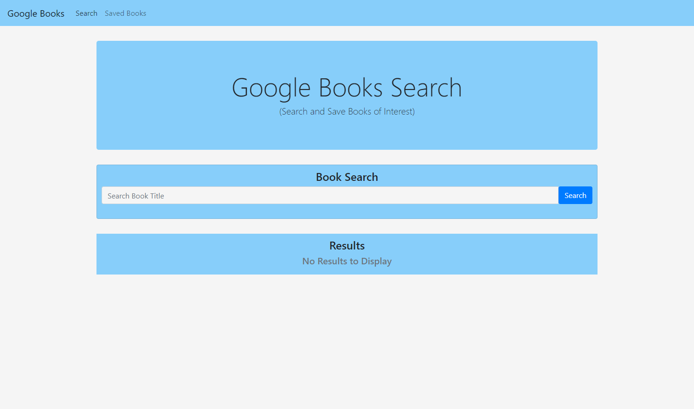
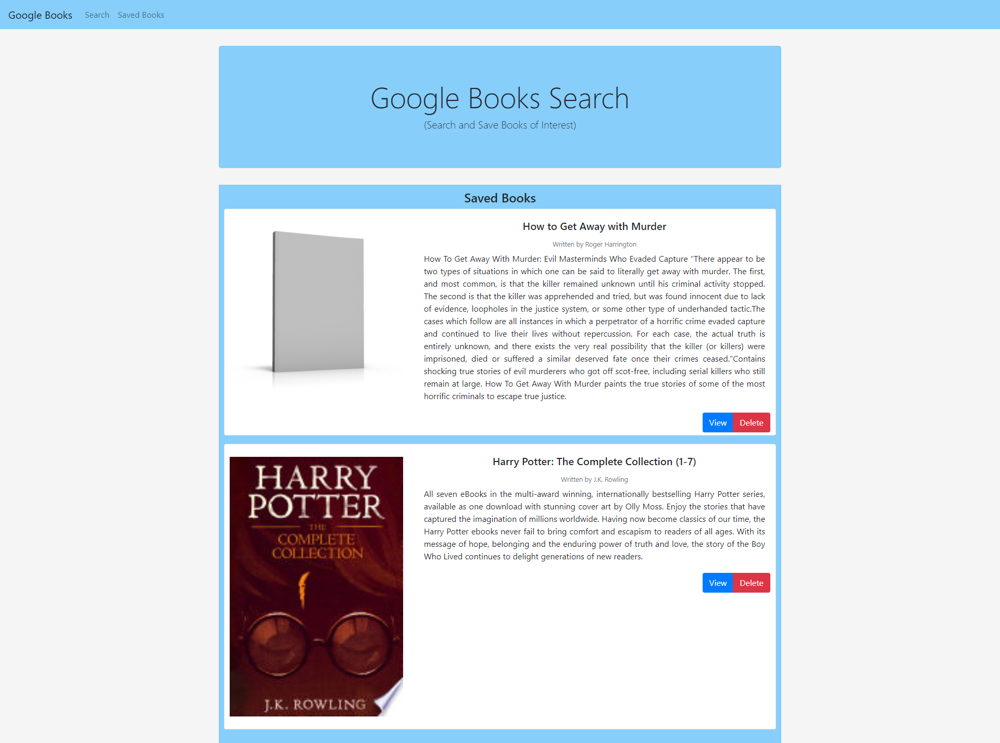

# Google Books Search

## Table of Contents
* [Description](#description)
* [Installation](#installation)
* [Dependencies](#dependencies)
* [Usage](#usage)
* [Screenshot](#screenshot)
* [Questions](#questions)
* [Credits](#credits)
* [License](#license)

## Description
This is a React-based Google Books Search app. This assignment requires you to create React components, work with helper/util functions, and utilize React lifecycle methods to query and display books based on user searches. You'll also use Node, Express and MongoDB so that users can save books to review or purchase later

## Installation
Node.js is needed for this application.

### Dependencies 
* express
* mongoose
* axios
* react-router-dom

## Usage
The app allows users to search for books. The user enters the name of the book into the search area the click on search. A list of all the books related are populated in the results area. The user has the option to view information about the book, as well as to save the book. When the user click on the view button, they are taken to another window to view information on the book. When the user clicks on the save button, the book is saved. On the navbar, the user is able to navigate to the saved books. All the books the that the user saves will be populated in the results area on that page. The user has the option to view or delete the books.

## Screenshot

## Questions  
  

If you have any questions, I can be reached via:
* <bold>Email</bold>: nash.walters@outlook.com

## Credits
* [Adam Simonini](https://github.com/adamsimonini)

## License     

Copyright © 2021 Nash Walters,

Released under the [MIT](https://github.com/nashwalters/eng-team-generator/blob/main/LICENSE) license.

